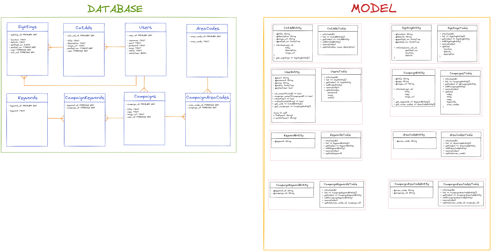

# Cat Board Web Design Recipe (Level Three)

## 1. Describe the Problem

_Put or write the user stories here. Add any clarifying notes you might have._

### Stage One
> As a user
>
> So that I can find my cat that I lost
>
> I want to post an advert for a lost cat with some description of the cat, and my telephone number so people can contact me
>

> As a user
> 
> So that I can help others find their lost cats
> I want to see all of the lost cat adverts
>
### Stage Two
> As a user
> 
> So that I can focus on the yet not-found cats
> I want to delete adverts for cats that have been found
> 

> As a user
> 
> So that I can update lost cat adverts with potential sightings
> 
> I want to update adverts

### Stage Three (More Challenging)
> As a user
> 
> So that I can protect my cat adverts from weird people
> 
> I want to give a password with each advert, and only people who give the right password can update or delete that advert

### Stage Four
> As an advertiser  
> 
> So that I can help people know about my cat-related services  
> 
> I want to submit ads to appear with the list of lost cat notices
> 

> As an advertiser  
> 
> So that I can help relevant people know about my cat-related services  
> 
> I want my ads to appear only with cat notices that mention certain keywords
> 
For example, if a lost cat notice mentions "Felix's favourite food is fish.",  
and an advertiser has submitted an ad that targets the keyword 'food' then their  
advert should appear near that lost cat notice.

> As an advertiser  
> 
> So that I can help local people know about my cat-related services  
> 
> I want my ads to also target people whose phone numbers start with a given prefix
> 
For example, if a lost cat notice has the phone number "01689 145214" and an  
advertiser has submitted an ad that targets the prefix "01689" then their advert  
should appear near that lost cat notice.

## 2. Design the Interface

_This is the fun part! Use excalidraw.com or a similar tool to design some
wireframes (rough sketches of the user interface). Include interactions and
transitions between pages — those are the most critical part._


## 3. Design the Database

_Design the data tables that will store all of the information your application
manages. Include the data types and examples of three rows. Consider use Google
Sheets or [AsciiTable](https://ozh.github.io/ascii-tables/) to do this._



## 4. Create Examples of User Interactions

_Create examples of user interactions and expectations._

```ruby

```

## 6. Test-Drive the Behaviour

_Follow this cycle:_

1. Add a feature test in `/spec/feature/` (RED)
2. Implement the behaviour in `app.rb`
3. Does it pass without data model changes? (GREEN) Then skip to step 6.
4. Otherwise, add a unit test for the data model to `/spec/unit` (RED)
5. Implement the behaviour in your data model class. (GREEN)
6. Apply any refactors to improve the structure of the code. (REFACTOR)  
   Run `rubocop` as part of this.
7. Go back to step 1.
